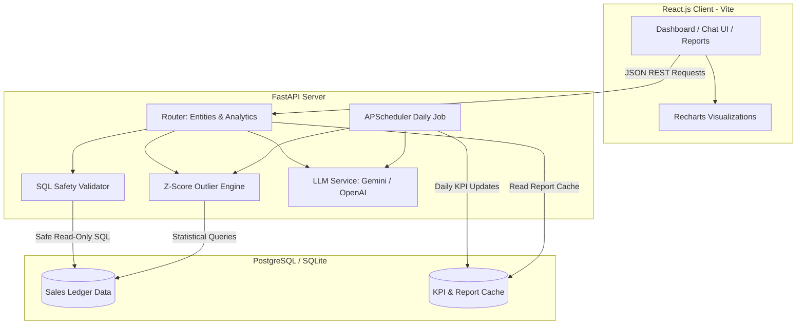

# AI-Powered Business Insights 

A full-stack, enterprise-grade business intelligence and analytics application. Designed as a portfolio project demonstrating Python backend architecture, secure SQL modeling, GenAI integrations (Text-to-SQL and narrative reports), and interactive data visualizations.

---

## Architecture Diagram



---

## Features

1. **Analytical Data Layer**: Normalized relational schema encompassing Products, Regions, Customers, Orders, and Order Items. Includes a statistical caching table for Daily KPIs.
2. **FastAPI Web Service**: Features REST CRUD endpoints for core assets alongside statistical routers computing monthly revenues, category splits, and daily Z-score anomalies.
3. **Secure Text-to-SQL Interface**: Converts unstructured business queries (e.g. *“what is our top selling product category?”*) into clean SQL statements. Statements undergo regex-token filters preventing mutation commands (`INSERT`, `UPDATE`, `DROP`, etc.) prior to database execution.
4. **Natural Language Summarization**: Connects to the Gemini/OpenAI API to parse raw result arrays into context-rich executive summaries.
5. **Automated Reporter**: A background job script that triggers daily to compute performance statistics, flag outliers, compile a markdown brief, and write the report back to the system database cache.
6. **Polished SPA UI**: Visual dashboard rendering trends, shares, and bar splits via Recharts. Includes an inline conversational console mapping natural language queries directly to data tables and inline graphs.

---

## Local Development (Quickstart with SQLite)

The repository comes pre-configured with a database-agnostic design, defaulting to a local SQLite database for zero-setup development.

### Backend Setup

1. **Initialize Virtual Environment & Install Dependencies**:
   ```bash
   python -m venv venv
   # Windows PowerShell
   venv\Scripts\Activate.ps1
   # Linux/macOS
   source venv/bin/activate

   pip install -r backend/requirements.txt
   ```

2. **Configure Environment Variables**:
   Create a `.env` file in the `backend/` folder (or copy `.env.example` to the root):
   ```env
   DATABASE_URL=sqlite:///./analytics.db
   LLM_PROVIDER=gemini
   GEMINI_API_KEY=your_gemini_api_key_here
   ```

3. **Seed Database**:
   Runs the Faker mock generator to create 365 days of transactions (including spiked anomaly days):
   ```bash
   python backend/scripts/seed.py
   ```

4. **Compile Initial Daily Report Cache**:
   ```bash
   python backend/scripts/daily_report.py --run-now
   ```

5. **Start FastAPI Application**:
   ```bash
   uvicorn backend.app.main:app --host 0.0.0.0 --port 8000 --reload
   ```
   Open `http://localhost:8000/docs` to test endpoints via Swagger.

6. **Execute Unit Tests**:
   ```bash
   # Run tests inside the backend directory to resolve app pathing
   cd backend
   ..\venv\Scripts\python -m pytest tests/test_analytics.py
   ```

---

### Frontend Setup

1. **Install Modules**:
   ```bash
   cd frontend
   npm install
   ```

2. **Launch Local Server**:
   ```bash
   npm run dev
   ```
   Open `http://localhost:5173` to explore the dashboard.

---

## Containerized Deployment (Docker + PostgreSQL)

For production staging (deployable to AWS EC2/RDS free tiers), the system orchestrates a PostgreSQL container, FastAPI backend, and Nginx reverse proxy.

1. **Configure Root Environment**:
   Populate `.env` in the root workspace folder:
   ```env
   GEMINI_API_KEY=your_gemini_api_key_here
   LLM_PROVIDER=gemini
   ```

2. **Build and Compose Containers**:
   ```bash
   docker-compose up --build
   ```

3. **Database Seeding in Container (Optional)**:
   ```bash
   docker exec -it pulse_fastapi_backend python scripts/seed.py
   docker exec -it pulse_fastapi_backend python scripts/daily_report.py --run-now
   ```

4. **Access Endpoints**:
   - **Frontend Dashboard**: `http://localhost` (Nginx port 80)
   - **FastAPI Documentation**: `http://localhost:8000/docs`

---

## SQL Safety & Sanitization Logic

Arbitrary SQL execution poses injection risks. The safety framework enforces three layers:

1. **Keyword Whitelisting**: Substrings are scanned against destructive commands. The validator rejects any query matching:
   `INSERT`, `UPDATE`, `DELETE`, `DROP`, `ALTER`, `TRUNCATE`, `CREATE`, `REPLACE`, `GRANT`, `REVOKE`, `INTO`, `EXEC`, `EXECUTE`, `COPY`, `MERGE`, `DATABASE`.
2. **SELECT Check**: Queries are stripped of comments and whitespace, and validated to ensure the statement starts explicitly with `SELECT`.
3. **Execution Context**: Executed within read-only transactions, ensuring any attempted database modifications are rejected at the database engine level.
